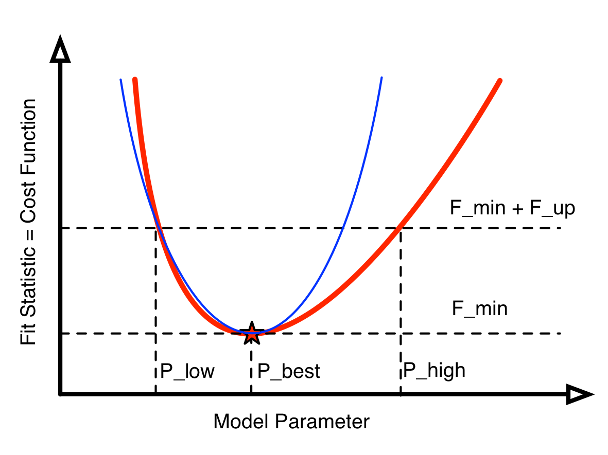
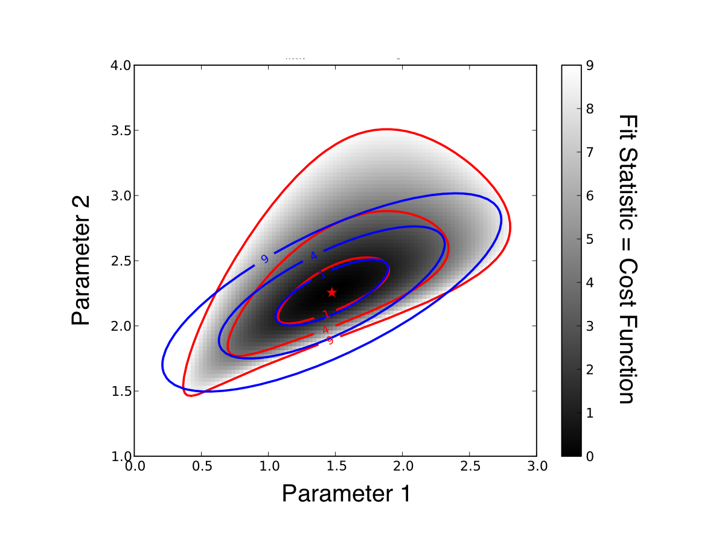

.. _introduction:

Introduction
============

Here we give a whirlwind introduction to the theory and definitions involved in fitting models to data.

If you haven't seen this before the following descriptions will probably too brief to be comprehensible. In that case you should read an introductory book or watch a video on this topic (see :ref:`introduction_references` below).

Basic concepts
--------------

What does it mean to fit a model to data?

* Data
* Model
* Paramters
* Fit statistic = Cost function

 Since Pythagoras, we know that :math:`a^2 + b^2 = c^2`.

Fitting one parameter
---------------------

:ref:`one parameter fitting illustration <fig:fitting_illustration_1d>`

.. _fig:fitting_illustration_1d:

Fitting multiple parameters
---------------------------

.. _fig:fitting_illustration_2d:

Parameter bounds
----------------

.. _introduction_references:

References
----------

Books:

* `"Statistical Models: Theory and Practice" by David Freedman <http://amzn.com/0521671051>`_
* `"Numerical Optimization: Theoretical and Practical Aspects" by Joseph-Frédéric Bonnans et al. <http://amzn.com/354035445X>`_
* `"Essential Statistics" by D.G. Rees <http://amzn.com/1584880074>`_
* `"Bayesian Data Analysis" by Andrew Gelman <http://amzn.com/158488388X>`_
* `"Think Stats" by Allen B. Downey <http://www.greenteapress.com/thinkstats/html/index.html>`_

* TODO: Minuit and RooFit user guide is useful.

Videos:

* `"Fitting Data" by Dr. Ranjith Padinhateeri, Department of Biotechnology, IIT Bombay <http://www.youtube.com/user/nptelhrd/videos?query=fitting+data>`_
* `"Statistics One" by Andrew Conway <https://www.coursera.org/course/stats1>`_ on `Coursera <https://www.coursera.org>`_
